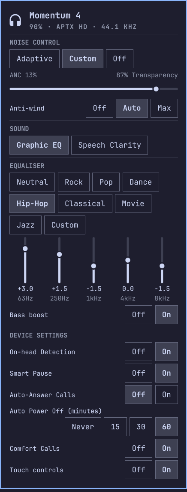

# Momentum4

Control your **Sennheiser Momentum 4** headphones from the [Omarchy](https://omarchy.org/) bar — battery, noise control, EQ and touch controls, without reaching for your phone.




This is built for one set of headphones. It speaks the Momentum 4's own
protocol, so it will not work with anything else. It is self-contained —
plain Python from the standard library, no extra packages, no binaries, and
nothing that needs root.

## Install

No setup, no root. Pair the headphones over Bluetooth, then:


```bash
omarchy plugin add https://github.com/DanSmith888/omarchy-momentum4.git --enable
```

### Check it

```bash
~/.config/omarchy/plugins/dansmith888.momentum4/bin/m4ctl doctor
```

Verifies every link from the headphones to the bar and tells you how to fix
whatever is broken. Put `bin/` on your `PATH` if you want `m4ctl` as a command.

## Update

```bash
omarchy plugin update dansmith888.momentum4 && omarchy restart shell
```

## Remove

```bash
omarchy plugin remove dansmith888.momentum4
```

That removes everything. The plugin never touched anything outside its own
folder and a lock file in `$XDG_RUNTIME_DIR`.

## Using it

**Left-click** the battery pill to open the panel. **Scroll** on it to adjust
noise level without opening anything. **Middle-click** to force a refresh.

To open the panel from a hotkey, bind:

```bash
omarchy-shell shell toggle dansmith888.momentum4
```

## What it does

Everything Sennheiser's **Smart Control** phone app exposes that the
headphones will tell us about:

- **Battery** in the bar, at a glance — and in the panel, the codec and
  sample rate PipeWire is actually sending (aptX HD · 44.1 kHz, say)
- **Noise control** — Adaptive / Custom / Off, with the ANC ↔ Transparency slider
- **Anti-wind** — Off / Auto / Max
- **Sound mode** — Graphic EQ or Speech Clarity
- **Five-band EQ** — Smart Control's eight presets, or drag any band yourself
- **Bass boost**
- **Touch controls** — enable or disable the on-cup controls
- **Device settings** — On-head Detection, Smart Pause, Auto-Answer Calls,
  Comfort Calls and Auto Power Off (the app's Device Settings pane)
- **Not covered**: Tone & voice prompts and the Hi-Res audio mode — their
  commands weren't found; see [PROTOCOL.md](PROTOCOL.md). Hi-Res is moot on
  Linux anyway: the link is aptX HD regardless. Charging state is announced
  by the headphones but can't be asked for, so a polling widget can't show it

Everything is read back from the headphones, so the panel always shows their
real state — change something in Smart Control and it follows.

## Requirements

- Omarchy with `omarchy-shell`
- A Sennheiser Momentum 4, paired over Bluetooth
- Python 3 (standard library only)

## Command line

The backend works on its own, if you'd rather script it:

```bash
m4ctl get                    # everything, human readable
m4ctl get --json             # everything, for scripts
m4ctl mode adaptive|custom|off
m4ctl antiwind off|auto|max
m4ctl transparency 0-100     # 0 = full ANC, 100 = full transparency
m4ctl sound-mode eq|speech
m4ctl preset Rock            # m4ctl presets to list them
m4ctl eq                     # show the curve
m4ctl eq-set 2 -1.5          # band 0-4, gain in dB
m4ctl bass on|off
m4ctl controls on|off        # on-cup touch controls
m4ctl auto-answer on|off
m4ctl comfort-call on|off
m4ctl smart-pause on|off
m4ctl on-head on|off
m4ctl auto-off never|15|30|60   # minutes idle before they switch off
m4ctl doctor
```

## Good to know

**Charging isn't shown.** The headphones announce cable in/out over GAIA but
offer no way to ask, and this widget polls rather than listens — so battery
keeps reading normally while charging and nothing says so.

**The "USB-C connected" label only appears when the cable goes to this PC
*and* the headphones enumerate as a USB audio device**, which they don't
always. What we can detect is that the headphones have enumerated as a **USB audio
card** on this host: plugged into a computer they present a sound device, and
`m4status` matches the first word of their Bluetooth name against
`/proc/asound/cards`.

So the label is really "plugged into this machine", not "charging":

| Cable goes to | Panel shows |
|---|---|
| This PC, enumerated as USB audio | "USB-C connected" |
| A wall charger, or another machine | nothing |

**EQ presets live in this repo, not the headphones.** The headphones only store
the active curve; Smart Control pushes preset values band by band, and so do we.
Definitions are in [`presets.json`](presets.json).

You *can* edit them, but be aware of the trade-off: Smart Control identifies a
preset by matching the curve values, so it shows a tick against whichever
preset the headphones currently match. Change a preset's numbers here and
applying it will no longer tick that preset in Smart Control — it will read as
a custom curve. Leave them as shipped if you want the two to agree; change them
if you prefer your own sound and don't mind the mismatch.

**Band labels are Smart Control's.** The panel shows 63Hz/250Hz/1kHz/4kHz/8kHz
to match it; the hardware's real centre frequencies are
90/325/1500/6500/6500 Hz.

## What runs, and as whom

Plugins run unsandboxed inside the Omarchy shell with your user's permissions,
so here is exactly what this one does:

- `bin/m4status` and `bin/m4ctl` are run by the widget as your user. They ask
  `bluetoothctl` which device is connected and talk to the headphones over an
  RFCOMM socket. Nothing else.
- No root, ever. No network access, no downloads, no background services, no
  writes outside `$XDG_RUNTIME_DIR` (a lock file).
- `tools/` is the reverse-engineering kit used to write [PROTOCOL.md](PROTOCOL.md).
  The widget never runs it. `tools/gaia-probe` sends arbitrary commands to the
  headphones — read its `--help` before pointing it at them.

## Related

[omarchy-momentumctl](https://github.com/timmo001/omarchy-momentumctl) is
another Omarchy panel for Sennheiser headsets, built on the external
[`momentumctl`](https://github.com/gjabell/momentumctl) CLI — whose source is
where the battery and phone-call command IDs used here came from.

## Protocol

The Momentum 4's GAIA command set is documented in [PROTOCOL.md](PROTOCOL.md) —
command IDs, payload formats, the tools used to find them, and the traps
involved. Useful if you're writing anything else for these headphones, on any
platform.

## Credits

Protocol constants and the RFCOMM channel-probing approach are derived from
[momentum4-control](https://github.com/f3Y0/momentum4-control) by f3Y0, MIT
licensed. The battery, on-head, auto-answer, Smart Pause and Comfort Call
command IDs come from [momentumctl](https://github.com/gjabell/momentumctl)
by gjabell, MIT licensed.

## Licence

MIT — see [LICENSE](LICENSE).
